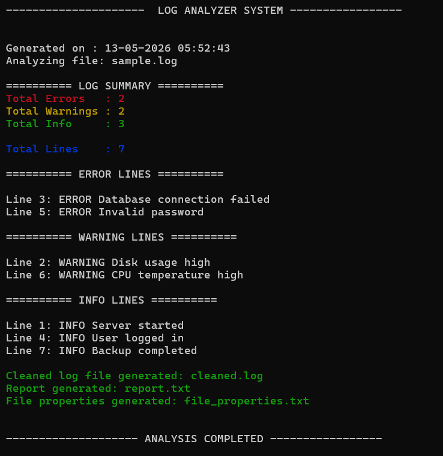

# Linux Log Analyzer Automation Tool

A beginner-friendly Linux automation project built using Bash scripting, AWK, SED, GREP, pipes, and Linux utilities.

This tool analyzes `.log` files, counts log levels, generates reports, extracts file properties, and creates cleaned log files automatically.

---

# Features

✅ Validates `.log` files before processing  
✅ Displays total ERROR, WARNING, and INFO logs  
✅ Shows log line numbers using AWK  
✅ Generates `report.txt` automatically  
✅ Generates `file_properties.txt` automatically  
✅ Creates cleaned log file using SED  
✅ Uses pipes (`|`) for log processing  
✅ Displays colored terminal output  
✅ Demonstrates Linux command automation

---

# Technologies Used

- Bash Scripting
- AWK
- SED
- GREP
- Pipes
- Linux Utilities

---

# Project Structure

```bash
log-analyzer/
│
├── analyzer.sh
├── sample.log
├── cleaned.log
├── report.txt
├── file_properties.txt
└── README.md
└── screenshots/
      └── output.png
```

---

# Sample Log File

```log
INFO Server started
WARNING Disk usage high
ERROR Database connection failed
INFO User logged in
ERROR Invalid password
WARNING CPU temperature high
INFO Backup completed
```

---

# How To Run

## Step 1 — Give Execute Permission

```bash
chmod +x analyzer.sh
```

## Step 2 — Run Script

```bash
./analyzer.sh sample.log
```

---

# Sample Output Screenshot

<p align="center">
  
</p>

---

# Generated Files

## report.txt

Contains:
- total logs
- summary report
- generation timestamp

## cleaned.log

Generated using SED by replacing:

```text
ERROR → CHECKED
```

## file_properties.txt

Contains:
- file name,size,permissions
- last modified time
- log frequency
- additional file properties

---

## Future Improvements

- Support multiple log files
- Add timestamp-based filtering
- Export reports in CSV format
- Add real-time log monitoring

---

Designed to demonstrate Bash scripting, log analysis, and Linux command-line automation.
